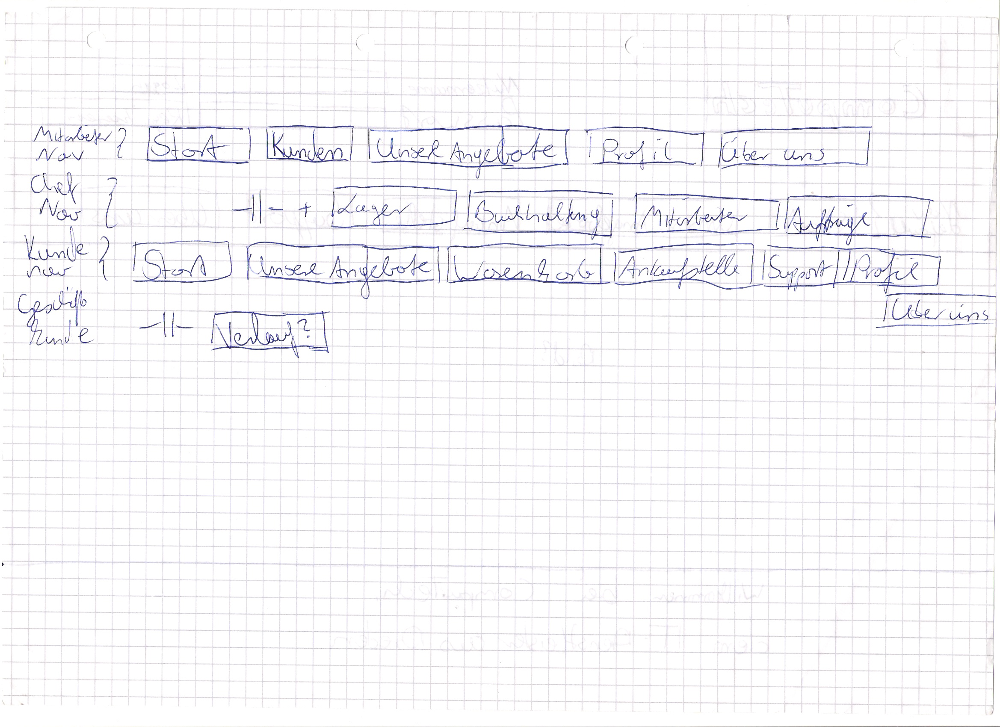
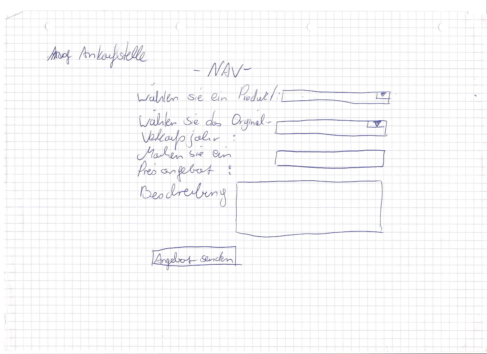
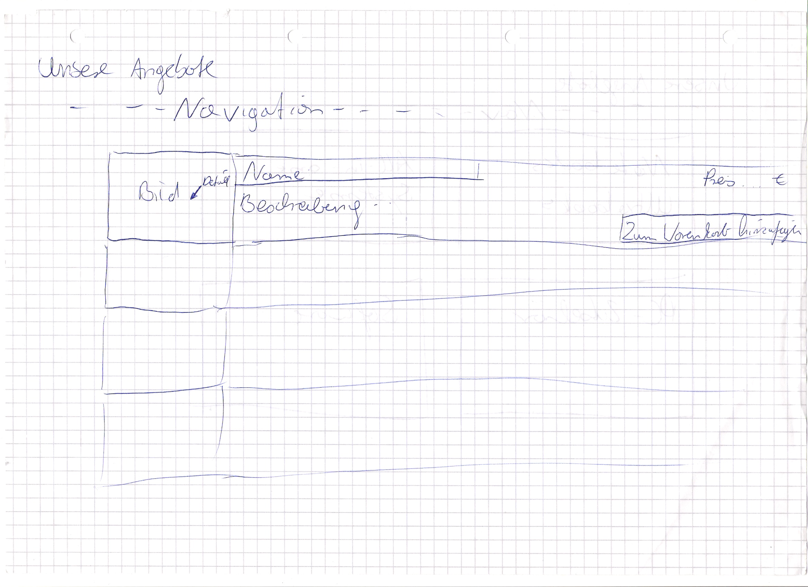
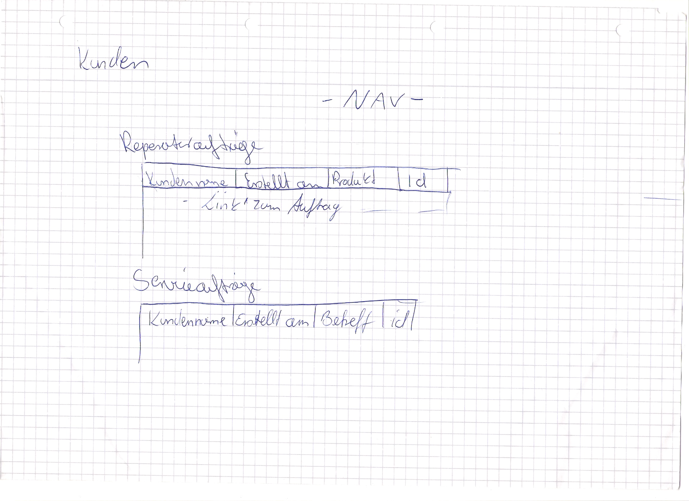
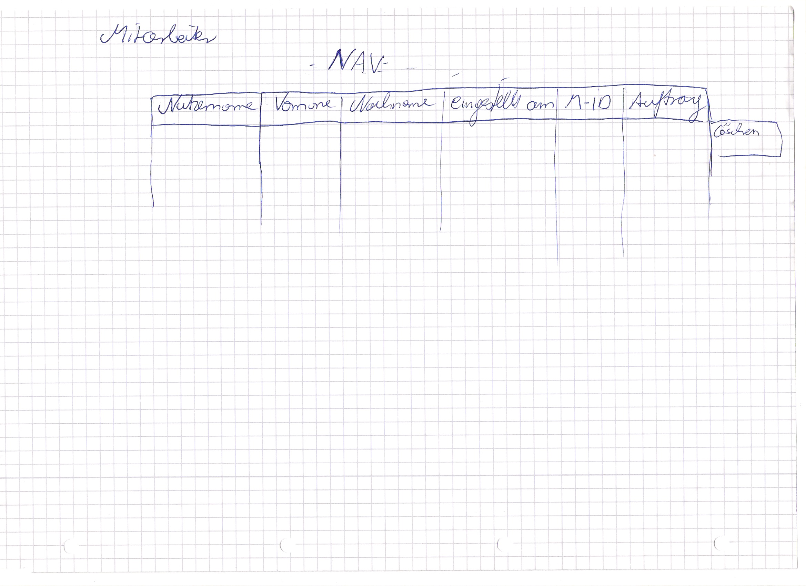
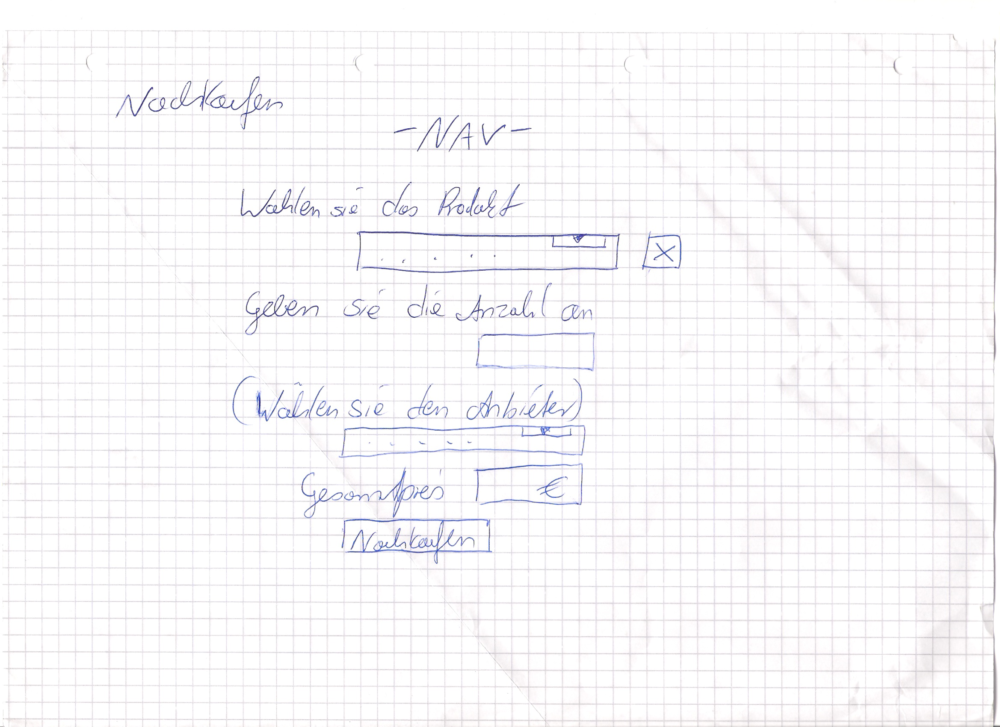
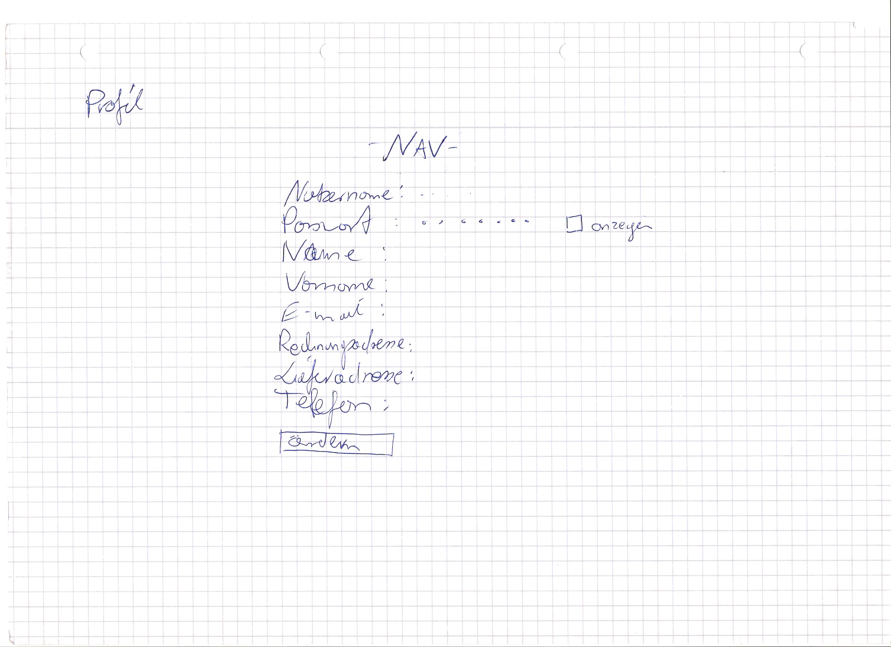
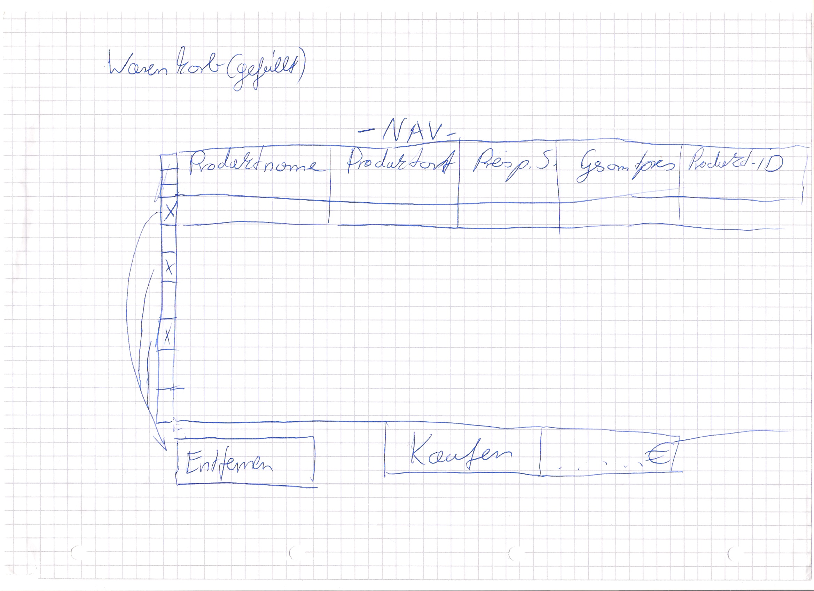

:hardbreaks:
:imagesdir: images

= Pflichtenheft

== CompuTech

__Version:__    *0.2*

__Status:__     *In Arbeit*

__Stand:__      *03.11.15*

== Zusammenfassung
Dieses Pflichtenheft beinhaltet ausschließlich den fachlichen Teil, der von dem Team um die IT-Dienstleister CompuTech, entwickelt wurde.

== Inhaltsverzeichnis

== Aufgabenstellung und Zielsetzung

IT-Dienstleister CompuTech

Die Firma CompuTech beliefert seine Kunden mit PC-Komplettsystemen sowie mit Zubehör und Verbrauchsmaterialien (CDs, Druckerpatronen, Toner, etc.). Die Firma kennt zwei Arten von Kunden, Privat - und Geschäftskunden(B2C & B2B). Ein neues IT-System soll die Beziehung zum Kunden vereinfachen und einen Wettbewerbsvorteil für seine Geschäftskunden bieten. Geschäftskunden können, wenn sie angemeldet sind, Bestellungen (nur Erweiterungen von Bestehender Hardware oder Upgrade) aufgeben sowie ihren derzeitigen EDV-Bestand einsehen. In der Bestandsanzeige soll der Kunde Geräte auswählen und mit Reparatur- oder Serviceaufträgen versehen können. Keine Aktion geschieht ohne Auftrag! Geschäftskunden werden von einem Mitarbeiter angelegt und mit einem vorläufigen Kennwort versehen welches der Kunde danach ändern kann. Privatkunden können sich selbst am System anmelden. Eine Überprüfung der Email und Postadresse (ähnlich Web.de) kann helfen die Gültigkeit einer Adresse zu prüfen. Hat sich der Kunde angemeldet so ist es ihm möglich sein, aus einer vorgegebenen Auswahl von Geräten ein Basismodell auszuwählen und dieses nach seinen Wünschen zu konfigurieren. Privatkunden sollen zudem die Möglichkeit bekommen gebrauchte Geräte wieder an CompuTech verkaufen zu können. Jeder Geschäftskunde hat einen bestimmten Verkaufsleiter als Ansprechpartner. Dieser wird zugeordnet wenn der Verkaufsleiter den Geschäftskunden in der Datenbank anlegt. Der Verkaufsleiter nimmt alle eingehenden Bestellungen und Serviceanfragen entgegen prüft diese und erstellt dann einen Auftrag an das Lager und den Service. Zudem entscheidet der Verkaufsleiter, zu welchem Preis Geräte von Privatkunden zurückgekauft werden. Das Lager verwaltet den Bestand aller Geräte und Verbrauchsmaterialien. Für alle Posten gibt es Mindestbestände. Werden diese unterschritten, bestellt das Lager automatisch aus einer Auswahl von Händlern zu den günstigsten Konditionen nach. Geht ein Auftrag von einem Verkaufsleiter ein, stellt das Lager die Bestellung zusammen (Kommissionierung) und erstellt dann einen Auftrag für den Versand, welcher sich dann um Auslieferung und Aufstellung der Gerät kümmert. Für den letzten Punkt muss ein Auftrag für den Service erstellt werden. Das System soll zudem ein „Kassenbuch“ führen, welches die Buchhaltung und den Jahresabschluss vereinfachen soll. Hierzu sollen alle Transaktionen gespeichert und nach bestimmten Filterkriterien gedruckt werden können. Auf diese Daten hat natürlich nur der Geschäftsführer und die Buchhaltung Zugriff. Dem Kunden ist es besonders wichtig, dass seine Geschäftsprozesse von dem zu entwickelnden IT-System vollständig abgebildet werden.

== Fachlicher Überblick
Einleitung für fachfremde Personen

== Systemgrenze und Top-Level-Architektur

=== Kontextdiagramm
Das Kontextdiagramm zeigt das geplante Software-System in seiner Umgebung. Zur Umgebung gehören alle Nutzergruppen des Systems und Nachbarsysteme. Die Grafik kann auch informell gehalten sein. Überlegen Sie sich dann geeignete Symbole. Die Grafik kann beispielsweise mit Visio erstellt werden. Wenn nötig, erläutern Sie diese Grafik.

=== Analyseklassendiagramm
image::diagrams/Analyseklassendiagramm.jpg[Startseite, 450, link="images/diagrams/Analyseklassendiagramm.jpg"]

=== Top-level architecture
image::diagrams/TopLevelArchitecture.jpg[Startseite, 450, link="images/diagrams/TopLevelArchitecture.jpg"]

== Anwendungsfälle

=== Überblick Anwendungsfalldiagramm
Anwendungsfall-Diagramm, das alle Anwendungsfälle und alle Akteure darstellt
=== Akteure

Akteure sind die Benutzer des Software-Systems oder Nachbarsysteme, welche darauf zugreifen. Dokumentieren Sie die Akteure in einer Tabelle. Diese Tabelle gibt einen Überblick über die Akteure und beschreibt sie kurz. Die Tabelle hat also mindestens zwei Spalten (Akteur Name und Kommentar).

// See http://asciidoctor.org/docs/user-manual/#tables
[options="header"]
|===
|Name |Beschreibung |
|Chef | Geschäftsführer |
|Mitarbeiter| Angestellter, der für Service verantwortlich ist |
|Privatkunde| Privatperson, die gleichzeitig Verbraucher ist|
|Geschäftskunde | Kunde, der eine Firma vertritt|
|Händler | Verkäufer der Hardware|
      |…            |
|===

=== Anwendungsfallbeschreibungen
Dieser Unterabschnitt beschreibt die Anwendungsfälle. In dieser Beschreibung müssen noch nicht alle Sonderfälle und Varianten berücksichtigt werden. Schwerpunkt ist es, die wichtigsten Anwendungsfälle des Systems zu finden. Wichtig sind solche Anwendungsfälle, die für den Auftraggeber, den Nutzer den größten Nutzen bringen.
Für komplexere Anwendungsfälle ein UML-Sequenzdiagramm ergänzen.
Einfache Anwendungsfälle mit einem Absatz beschreiben.
Die typischen Anwendungsfälle (Anlegen, Ändern, Löschen) können zu einem einzigen zusammengefasst werden.

== Anforderungen

=== Muss-Kriterien

Allgemeine Kriterien
M010 - Jede berechtigte Person kann sich einloggen
M020 - Jede eingeloggte Person kann sich ausloggen

Chef
M030 - Kann manuell Lager verwalten
M040 - Kann Accounts verwalten
M050 - Hat Zugriff auf Buchhaltung und Bilanzen

Mitarbeiter
M060 - Service und Reperaturanfrage bearbeiten
M070 - Preisvorschlag beim Einkauf
M080 - Neue Produkte hinzufügen

Privatkunde
M090 - Kann sich registrieren
M100 - Kann gebrauchte Geräte verkaufen
M110 - Kann Artikel in Warenkorb legen
M120 - Kann Artikel aus dem Warenkorb entfernen
M130 - Kann Bestellung absenden

Geschäftskunde
M140 - Kann Artikel in Warenkorb legen
M150 - Kann Artikel aus dem Warenkorb absenden
M160 - Kann Bestellung absenden

=== Kann-Kriterien
K010 - Bestätigungs-E-Mail bei Anmeldung
K020 - Suchfeld
K030 - Geschäftskunde kann sein Passwort ändern

== GUI Prototyp

[caption="Startseite: "]
[.left]
image::gui-prototype/startseite.jpg[Startseite, 450, title=Beschreibung, link="images/gui-prototype/startseite.jpg"]

[caption="Startseite: "]
[.left]

[caption="Ankaufstelle: "]
[.left]

[caption="Angebote: "]
[.left]
image::gui-prototype/angebote_uebersicht.jpg[Angebote, 450, title=Beschreibung, link="images/gui-prototype/angebote_uebersicht.jpg"]

[caption="Angebote: "]
[.left]

[caption="Buchhaltung: "]
[.left]
image::gui-prototype/buchhaltung.jpg[Buchhaltung, 450, title=Beschreibung, link="images/gui-prototypebuchhaltung.jpg"]

[caption="Kundenübersicht: "]
[.left]

[caption="Lager: "]
[.left]
image::gui-prototype/lager.jpg[Lager, 450, title=Beschreibung, link="images/gui-prototype/lager.jpg"]

[caption="Mitarbeiterübersicht: "]
[.left]

[caption="Nachkaufformular: "]
[.left]

[caption="Nutzerprofil: "]
[.left]

[caption="Produktdetails: "]
[.left]
image::gui-prototype/produktdetails.jpg[Produktdetails, 450, title=Beschreibung, link="images/gui-prototype/produktdetails.jpg"]

[caption="Registrierungsformular: "]
[.left]
image::gui-prototype/registrieren.jpg[Registrierungsformular, 450, title=Beschreibung, link="images/gui-prototype/registrieren.jpg"]

[caption="Warenkorb: "]

=== Überblick: Dialoglandkarte
Erstellen Sie ein Übersichtsdiagramm, das das Zusammenspiel Ihrer Masken zur Laufzeit darstellt. Also mit welchen Aktionen zwischen den Masken navigiert wird. Die nachfolgende Abbildung zeigt eine an die Pinnwand gezeichnete Dialoglandkarte. Ihre Karte sollte zusätzlich die Buttons/Funktionen darstellen, mit deren Hilfe Sie zwischen den Masken navigieren.

=== Dialogbeschreibung
Für jeden Dialog:

1. Kurze textuelle Dialogbeschreibung eingefügt: Was soll der jeweilige Dialog? Was kann man damit tun? Überblick?
2. Maskenentwürfe (Screenshot, Mockup)
3. Maskenelemente (Ein/Ausgabefelder, Aktionen wie Buttons, Listen, …)
4. Evtl. Maskendetails, spezielle Widgets

== Datenmodell

=== Überblick: Klassendiagramm
UML-Analyseklassendiagramm

=== Klassen und Enumerationen
Dieser Abschnitt stellt eine Vereinigung von Glossar und der Beschreibung von Klassen/Enumerationen dar. Jede Klasse und Enumeration wird in Form eines Glossars textuell beschrieben. Zusätzlich werden eventuellen Konsistenz- und Formatierungsregeln aufgeführt.

// See http://asciidoctor.org/docs/user-manual/#tables
[options="header"]
|===
|Klasse/Enumeration |Beschreibung |
|…                  |…            |
|===

== Aktzeptanztestfälle
Mithilfe von Akzeptanztests wird geprüft, ob die Software die funktionalen Erwartungen und Anforderungen im Gebrauch erfüllt. Diese sollen und können aus den Anwendungsfallbeschreibungen und den UML-Sequenzdiagrammen abgeleitet werden. D.h., pro (komplexen) Anwendungsfall gibt es typischerweise mindestens ein Sequenzdiagramm (welches ein Szenarium beschreibt). Für jedes Szenarium sollte es einen Akzeptanztestfall geben. Listen Sie alle Akzeptanztestfälle in tabellarischer Form auf.
Jeder Testfall soll mit einer ID versehen werde, um später zwischen den Dokumenten (z.B. im Test-Plan) referenzieren zu können.

== Offene Punkte
Offene Punkte werden entweder direkt in der Spezifikation notiert. Wenn das Pflichtenheft  zum finalen Review vorgelegt wird, sollte es keine offenen Punkte mehr geben.
